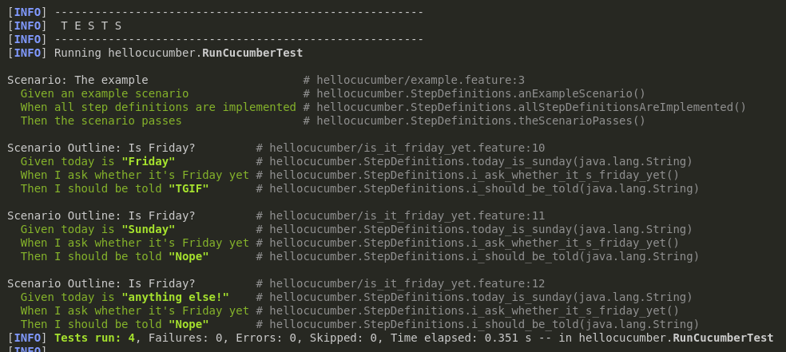
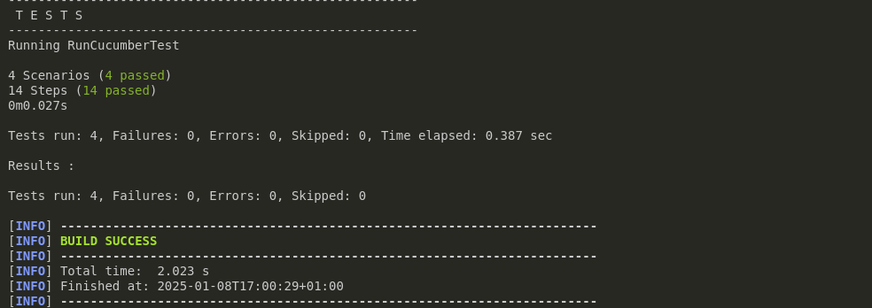

= R5.A.08 -- Dépôt pour les TPs
:icons: font
:MoSCoW: https://fr.wikipedia.org/wiki/M%C3%A9thode_MoSCoW[MoSCoW]

Ce dépôt concerne les rendus de mailto:leo.teillol@etu.univ-tlse2.fr[Leo Teillol].

== TP1

.is_it_friday_yet.feature
[source,java]
----
Feature: Is It Friday Yet?

Scenario Outline: Is Friday?
    Given today is "<day>"
    When I ask whether it's Friday yet
    Then I should be told "<answer>"

    Examples:
        | day            | answer |
        | Friday         | TGIF   |
        | Sunday         | Nope   |
        | anything else! | Nope   |
----

.Tests TP1

== TP2

.Order.java
[source,java]
----
import java.util.ArrayList;
import java.util.List;

public class Order {
    String owner;
    String target;
    List<String> cocktails;
    String message = null;
    
    
    public Order() {
        cocktails = new ArrayList();
    }

    public void declareOwner(String owner) {
        this.owner = owner;
    }

    public void addCocktail() {
        cocktails.add(owner);
    }

    public void declareTarget(String target) {
        this.target = target;
        cocktails.removeAll(cocktails);
    }

    public List<String> getCocktails() {
        return cocktails;
    }

    public void addMessage(String string) {
        message = "From " + owner + " to " + target +": " + string;
    }

    public String getMessage() {
        return message;
    }

}
----

.Tests TP2

