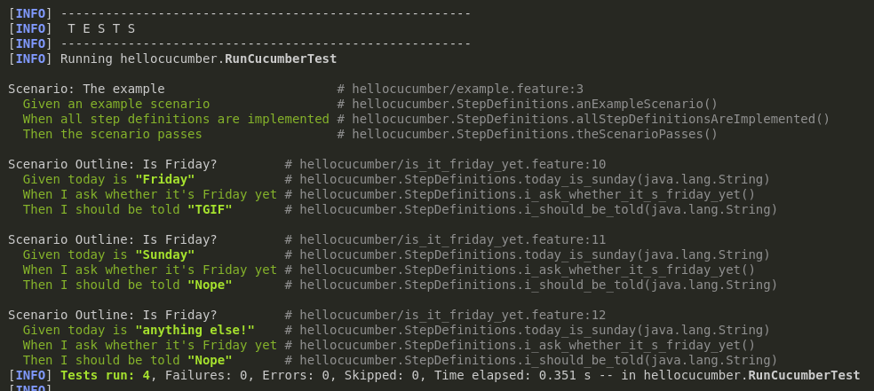

= R5.A.08 -- Dépôt pour les TPs
:icons: font
:MoSCoW: https://fr.wikipedia.org/wiki/M%C3%A9thode_MoSCoW[MoSCoW]

Ce dépôt concerne les rendus de mailto:leo.teillol@etu.univ-tlse2.fr[Leo Teillol].

== TP1

.Exemple de code
[source,java]
----
Feature: Is It Friday Yet?

Scenario Outline: Is Friday?
    Given today is "<day>"
    When I ask whether it's Friday yet
    Then I should be told "<answer>"

    Examples:
        | day            | answer |
        | Friday         | TGIF   |
        | Sunday         | Nope   |
        | anything else! | Nope   |
----

.Tests TP1
